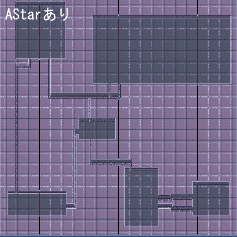
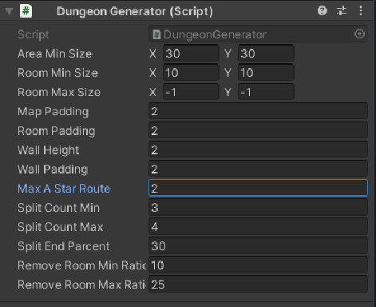
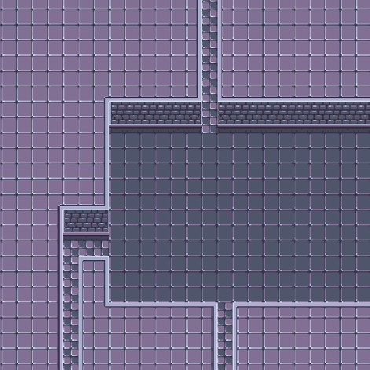

# Dungeon Generator  
## 概要  
>ジャンル: マップ自動生成  
>制作人数: 1人  
>製作期間: 1週間  
>制作時期: 4年次  
>>#### 開発環境
>>エンジン: Unity  
>>言語: C#  
>>使用アセット: 2D Tilemap Extras
>実行環境:  
>>OS: Windows 10  
>>RAM: 8GB  
>>GPU: Intel i5-8250U  
  
## 開発目的  
現在作っている途中のスマホゲームで使っている自作のマップ自動生成スクリプト。
区域分割法を利用した自動生成方法を活用したが、部屋のつながりに複雑性がなく、直線的になりがちだったので
AStarアルゴリズムを活用して部屋と部屋をつなぐアレンジを加えて自分が納得いく形となった。  
  
## 頑張った点
- 設定項目を沢山用意することで様々な形に対応できるようにした。
	- エリアの最小サイズ  
	- 部屋の最小・最大サイズ  
	- エリアの分割数  
	- etc  
- AStarアルゴリズムを活用した道の追加  
- 壁の生成  
  
## スクリーンショット
![AStarなし(ScreenShot/s1.png)

